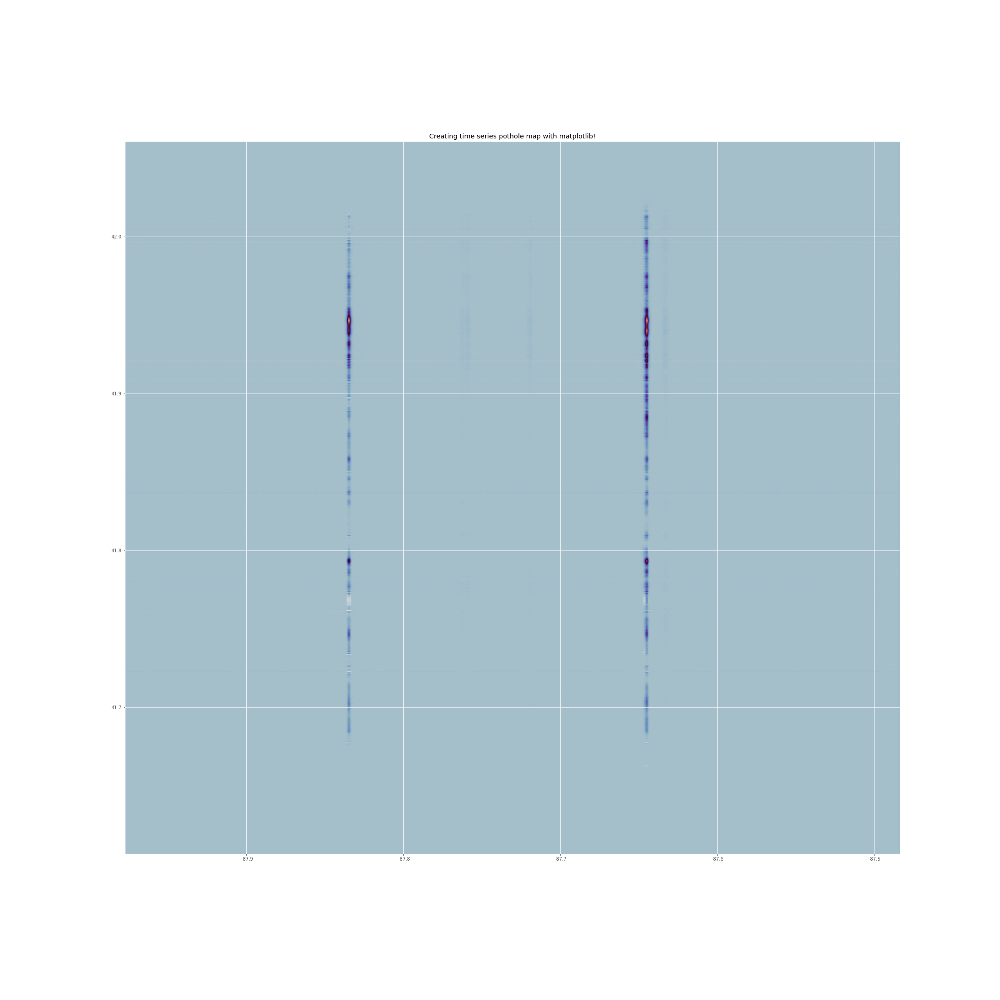
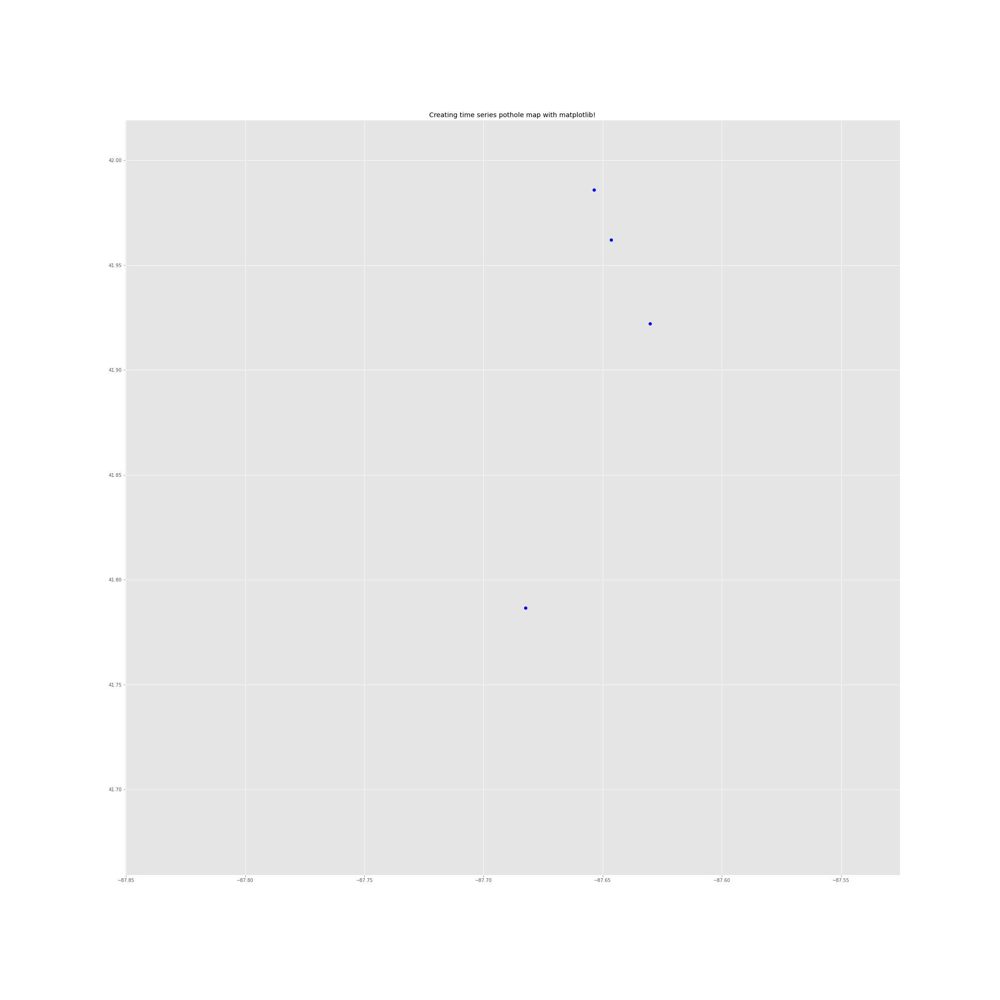

# Chicago_Pothole_Tracker

## A Geodjango API for future 10 day pothole zone forecast based on last 30 day pothole report

### React.js frontend with MAPBOX GL

### Geopandas logic dataframe dissolve

### Keras TensorFlow LSTM prediction

Pothole Density 10 Day Ahead Forecast

Pothole Location from 2011-2018 aggreggated from 311 calls

Pothole Density 10 Day Ahead Forecast 2020 

Pothole patched Location from 2020 aggreggated

